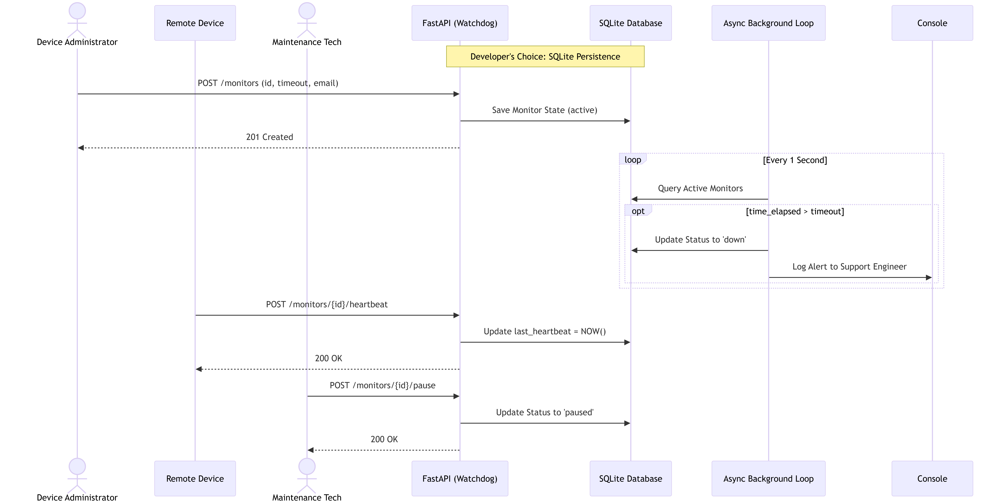
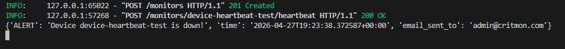
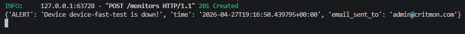
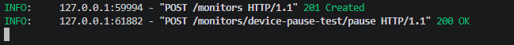

# CritMon Watchdog API (Pulse-Check)

This is a robust "Dead Man's Switch" backend service designed for CritMon Servers Inc. to monitor the uptime of remote solar farms and unmanned weather stations in low-connectivity areas. 

If a registered device fails to send a heartbeat ping before its countdown timer expires, the system automatically triggers an asynchronous alert to the support team.

## 1. Architecture Diagram

Here is the Sequence Diagram mapping out the core API endpoints, failure state (background Watchdog task), and our persistent database architecture. 



## 2. Setup Instructions

This API is built using **Python 3** and **FastAPI**.

**1. Clone the repository and navigate to the project folder:**
```bash
git clone <your-fork-url>
cd AmaliTech-DEG-Project-based-challenges/backend/Pulse-Check
```

**2. Install the required dependencies:**
```bash
pip install -r requirements.txt
``` 

**3. Run the development server:**
```bash
uvicorn main:app --reload
```
The server will start at `http://127.0.0.1:8000`. You can access the interactive Swagger UI documentation at `http://127.0.0.1:8000/docs`.

## 3. API Documentation

### I. Register a Monitor
Registers a new remote device and begins its countdown timer.
*   **Endpoint:** `POST /monitors`
*   **Payload:**
    ```json
    {
      "id": "device-123",
      "timeout": 60,
      "alert_email": "admin@critmon.com"
    }
    ```
*   **Success Response:** `201 Created`

### II. Send a Heartbeat (Reset)

Receives a ping from the remote device and resets its countdown timer back to zero.
*   **Endpoint:** `POST /monitors/{id}/heartbeat`
*   **Path Parameter:** `id` (string)
*   **Success Response:** `200 OK`
*   **Error Response:** `404 Not Found` (if device ID does not exist).

### III. The Background Alert (Failure State/ Watchdog)

The API runs a continuous `asyncio` background task. If an active device exceeds its timeout without sending a heartbeat, the system logs the following critical error to the server console:
`{'ALERT': 'Device device-123 is down!', 'time': '<timestamp>', 'email_sent_to': 'admin@critmon.com'}`

### IV. Pause a Monitor (Snooze)

Pauses the timer indefinitely so maintenance technicians can work on a device without triggering false alerts. Hitting the heartbeat endpoint will un-pause the monitor.
*   **Endpoint:** `POST /monitors/{id}/pause`
*   **Path Parameter:** `id` (string)
*   **Success Response:** `200 OK`

## 4. The "Developer's Choice" Challenge
**Added Feature: Persistent SQLite Database Storage**

**Why I added this:**
Most basic APIs are stateless, but while this API task requires stateful timers, if built using standard in-memory Python dictionaries to store the timers, the data lives entirely in the server's RAM. This means if the FastAPI server crashes, restarts, or undergoes maintenance, all monitors are instantly deleted, and the system forgets everything. Because CritMon monitors critical infrastructure, data loss during a server restart is a catastrophic failure. 

To curb this, I implemented a lightweight **SQLite Database using SQLAlchemy**. For every monitor registration or update, heartbeat timestamp, and pause status, its state is saved to the database. Instead of relying on fragile, temporary server memory, the background loop queries this database as a single source of truth, ensuring that no data is ever lost even if the server crashes. If the FastAPI server ever restarts, it first checks the database to reload and resume monitoring any active devices. Thereby making the system production-ready and fault-tolerant.